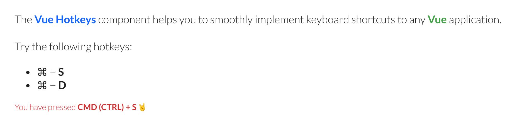

# Vue Hotkeys

<style>
img {
  box-shadow: 0 0 12px rgba(0,0,0,0.3);
  border-radius: 5px;
}
</style>

<br >



<br >

## Getting started

Install the component as a dependency of your project.

```sh
$ npm install vue-hotkeys-rt -S
```

Import it to your Vue app.

```js
import Vue from 'vue/dist/vue.js';
import Hotkeys from 'vue-hotkeys-rt';
```

Now use it on the Vue app.

```js
new Vue({
  ...
  components: { Hotkeys },
  ...
});

```

## Handling pressed keyboard shortcuts

Vue Hotkeys emits the `triggered` event always a shortcut is pressed. So, everything you need to do is define a handler that will take an action depending on the pressed keys.

```vue
<template >
  <div >
    <hotkeys
      :shortcuts="['S', 'D']"
      :debug="true"
      @triggered="onTriggeredEventHandler"
    />
  </div>
</template>

<script lang="ts">
import Hotkeys from 'vue-hotkeys-rt';

export default {
  ...
  components: { Hotkeys },

  methods: {
    onTriggeredEventHandler(payload) {
      console.log(`You have pressed CMD (CTRL) + ${payload.keyString}`);
    }
  }
  ...
};
</script>

```

## Contributing

Do you know `Vue.js` and would like to contribute? 🙌 Great, I'd love to have you helping improve this tool. Just clone this repository and send back your contributions as `pull requests`.

Wanna chat? 🙂 Drop me a line on [Twitter](https://twitter.com/rogeriotaques).
